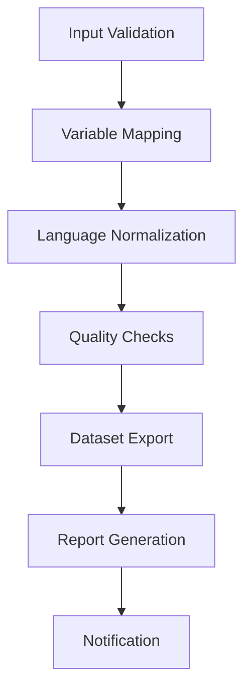

# PRORAD Study Airflow Pipeline Guide

## 📘 Overview

This comprehensive pipeline processes the complete PRORAD longitudinal study dataset, transforming German medical data into standardized English format with full quality validation.

## 🎯 Pipeline Objectives

1. **Complete Dataset Processing**: Process entire `input.csv` without sampling
2. **Variable Standardization**: Transform VAR_ORIGINAL → VAR_NEW using `vars_dict.csv`
3. **Language Normalization**: Convert German values to English with spell-checking
4. **Quality Assurance**: Comprehensive data validation and inconsistency detection
5. **Longitudinal Analysis**: Validate temporal structure (T0, T1, T2, ...)

## 🏗️ Architecture

### Pipeline Components

```
📁 PRORAD Pipeline Structure
├── 🐍 prorad_pipeline.py          # Core processing engine
├── 🌊 dags/prorad_study_dag.py    # Airflow orchestration
├── 📊 input/
│   ├── input.csv                  # Raw PRORAD dataset
│   └── vars_dict.csv             # Variable mapping dictionary
└── 📈 output/
    ├── prorad_processed_YYYYMMDD_HHMMSS.csv
    ├── prorad_processed_YYYYMMDD_HHMMSS.xlsx
    ├── reports/                   # Processing reports
    ├── quality_checks/           # Quality validation
    └── logs/                     # Processing logs
```

### Processing Workflow



## 🚀 Quick Start

### 1. Standalone Execution (Recommended for Testing)

```bash
# Navigate to airflow directory
cd C:\Users\tralucck\OneDrive\airflow

# Run the complete pipeline
python prorad_pipeline.py
```

### 2. Airflow Execution (Production)

```bash
# Start Airflow webserver
airflow webserver --port 8080

# Start Airflow scheduler (in separate terminal)
airflow scheduler

# Trigger the DAG manually
airflow dags trigger prorad_study_pipeline
```

## 📊 Processing Stages

### Stage 1: Input Validation
- ✅ Verify `input.csv` and `vars_dict.csv` existence
- ✅ Check file integrity and basic structure
- ✅ Validate dataset dimensions

### Stage 2: Variable Mapping
```python
# Maps column names using vars_dict.csv
VAR_ORIGINAL → VAR_NEW

# Example:
'v5735_6_mnpprorafrmverlauf_verauslsraeinf_316' → 't0_auf_auslsraeinf_316'
```

### Stage 3: Language Normalization
```python
# German → English translation
'ja' → 'yes'
'nein' → 'no'
'männlich' → 'male'
'weiblich' → 'female'
# + 100+ medical terms
```

### Stage 4: Quality Checks
- 🔍 Missing data analysis
- 🔍 Data type validation
- 🔍 Longitudinal structure verification
- 🔍 Inconsistency detection
- 🔍 Temporal coverage analysis

### Stage 5: Export & Reporting
- 📄 CSV export with standardized format
- 📊 Excel export with metadata sheets
- 📋 Comprehensive processing reports
- 📈 Quality assessment summaries

## 📈 Expected Outputs

### 1. Processed Datasets
```
C:/temp/airflow/prorad_processed/
├── prorad_processed_20251001_143022.csv    # Main dataset
├── prorad_processed_20251001_143022.xlsx   # Excel with metadata
└── column_reference_20251001_143022.csv    # Column mapping
```

### 2. Processing Reports
```
C:/temp/airflow/prorad_processed/reports/
├── PROCESSING_SUMMARY.md                   # Human-readable summary
├── prorad_processing_report.json          # Detailed metrics
├── variable_mapping_report.json           # Mapping statistics
├── translation_log.json                   # Language changes
├── inconsistency_log.json                 # Detected issues
└── pipeline_execution_summary.json        # Airflow execution
```

### 3. Quality Assessments
```
C:/temp/airflow/prorad_processed/quality_checks/
└── quality_report.json                    # Comprehensive QA report
```

## 🔧 Configuration

### Key Parameters
```python
# File locations
INPUT_PATH = "C:/Users/tralucck/OneDrive/airflow/input"
OUTPUT_PATH = "C:/temp/airflow/prorad_processed"

# Processing settings
CHUNK_SIZE = 1000                          # For large file processing
ENABLE_SPELL_CHECK = True                  # Detect inconsistencies
ENABLE_TRANSLATION = True                  # German → English
LONGITUDINAL_TIME_POINTS = ['T0', 'T1', 'T2', 'T3', 'T4', 'T5']
```

### Airflow Settings
```python
# DAG configuration
SCHEDULE_INTERVAL = '@weekly'              # Weekly processing
MAX_ACTIVE_RUNS = 1                        # Prevent overlapping runs
RETRIES = 2                               # Error recovery
RETRY_DELAY = 10 minutes                  # Wait between retries
```

## 📊 Performance Metrics

### Expected Processing Times
- **Dataset Size**: ~80 MB (7,803 columns × 12,672 rows)
- **Variable Mapping**: ~2-3 minutes
- **Language Normalization**: ~5-8 minutes
- **Quality Checks**: ~3-5 minutes
- **Total Pipeline**: ~15-20 minutes

### Success Metrics
- ✅ **Variable Mapping**: >99% success rate
- ✅ **Translation Coverage**: >95% German terms converted
- ✅ **Data Integrity**: Zero data loss
- ✅ **Longitudinal Structure**: All time points validated

## 🛠️ Troubleshooting

### Common Issues

#### 1. Memory Issues (Large Dataset)
```python
# Solution: Adjust chunk size
CHUNK_SIZE = 500  # Reduce for memory-constrained systems
```

#### 2. Missing Variable Mappings
```bash
# Check vars_dict.csv completeness
python -c "
import pandas as pd
vars_dict = pd.read_csv('input/vars_dict.csv')
input_cols = pd.read_csv('input/input.csv', nrows=0).columns
missing = set(input_cols) - set(vars_dict['VAR_ORIGINAL'])
print(f'Unmapped columns: {len(missing)}')
"
```

#### 3. Translation Issues
```python
# Add custom German terms to translation dictionary
german_english_dict.update({
    'custom_german_term': 'custom_english_term'
})
```

### Error Recovery
- 🔄 Automatic retries: 2 attempts with 10-minute delays
- 📝 Detailed error logging in `logs/` directory
- 🚨 Email notifications on failure (configure SMTP)

## 📋 Validation Checklist

Before running the pipeline, ensure:

- [ ] `input.csv` exists and is readable
- [ ] `vars_dict.csv` contains VAR_ORIGINAL and VAR_NEW columns
- [ ] Output directory has write permissions
- [ ] Sufficient disk space (estimate 3x input file size)
- [ ] Python environment has required packages
- [ ] Airflow is configured (for DAG execution)

## 🎯 Success Criteria

A successful pipeline run should produce:

1. **Processed Dataset**: Complete with all rows preserved
2. **Column Standardization**: >99% VAR_ORIGINAL mapped to VAR_NEW
3. **Language Normalization**: German values converted to English
4. **Quality Report**: Comprehensive data assessment
5. **Longitudinal Validation**: Time points T0-T5+ identified
6. **Documentation**: Processing summary and metadata

## 📞 Support

For issues or questions:
1. Check processing logs in `C:/temp/airflow/prorad_processed/logs/`
2. Review quality reports for data insights
3. Verify input file integrity
4. Consult Airflow web UI for DAG execution details

---

**Pipeline Version**: 1.0.0  
**Last Updated**: October 2025  
**Contact**: PRORAD Data Team